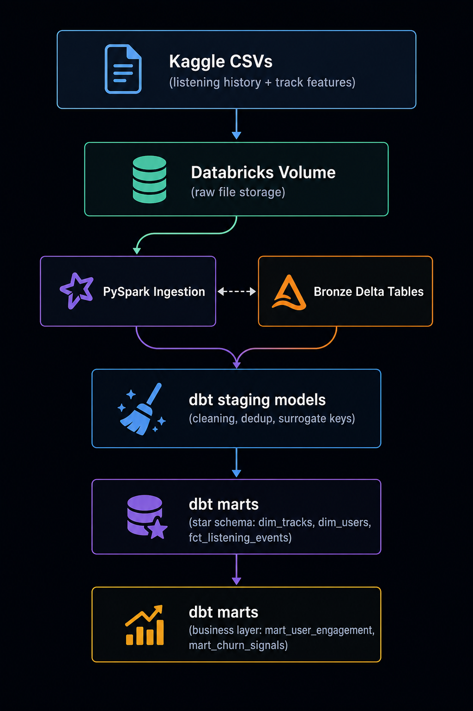
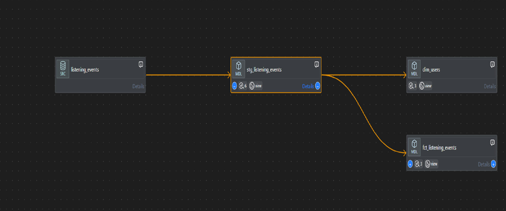

# Spotify Listening Analytics
End-to-end data platform built entirely on Databricks and dbt, modeling user
listening behavior and early churn signals from streaming event data.
## Business problem
Streaming platforms need to identify disengaging users before they cancel.
This project builds the feature engineering layer — engagement metrics and
churn-risk heuristics — that would feed into a production churn model.
## Architecture

Raw data lands directly in a Databricks Unity Catalog volume. PySpark reads
it into schema-enforced Bronze Delta tables. dbt (via the dbt-databricks
adapter) handles all downstream transformation — staging, deduplication,
and a star-schema mart layer — entirely within Databricks SQL Warehouses.
No external orchestration or storage layer was used; this reflects a
Databricks-native architecture pattern increasingly common in modern data
teams.
## Data sources
- **Listening history**: [Spotify Streaming History, Kaggle] — event-level
 play data (user, track, timestamp, ms played, skip signal)
- **Track features**: [Spotify Tracks Dataset, Kaggle] — audio features
 and metadata (genre, tempo, danceability, popularity)
## Data quality notes
- ~0.15% of listening events reference tracks not present in the track
 features dataset, likely due to catalog differences between sources.
 These are retained in the fact table with null track attributes rather
 than dropped, and excluded from genre-level rollups via left join.
- The source listening-history dataset was single-user; user_id was
 synthetically generated to simulate a multi-user population for
 portfolio purposes. This is documented transparently rather than
 hidden.
- Duplicate track_id rows in the source tracks dataset were resolved by
 keeping the highest-popularity version of each track.
## Key models
| Model | Layer | Purpose |
|---|---|---|
| `stg_listening_events` | Staging | Cleaned events, normalized skip logic |
| `stg_tracks` | Staging | Deduplicated track catalog |
| `fct_listening_events` | Marts | Central fact table, event-grain |
| `dim_tracks` / `dim_users` | Marts | Dimension tables |
| `mart_user_engagement` | Marts | Skip rate, completion rate, engagement tier 
per user |
| `mart_churn_signals` | Marts | First-half vs second-half behavior comparison, 
churn risk tier |
## Lineage

## Tech stack
Python · PySpark · Delta Lake · Databricks Unity Catalog · dbt Core
(dbt-databricks adapter) · SQL
## Running this project
1. Set up a Databricks Community Edition workspace and SQL Warehouse
2. Configure `spotify_dbt/profiles.yml` with your connection details
 (see `.env.example`)
3. `dbt deps && dbt run && dbt test`
## What I'd add with more time
- Airflow orchestration to automate the Bronze ingestion on a schedule
- A real churn classification model trained on the churn_signals features
- GitHub Actions CI to run dbt tests on every PR